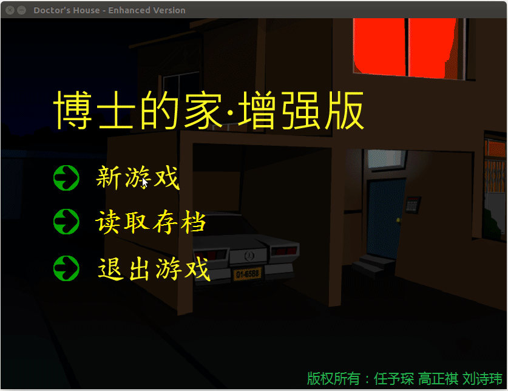

# Dr' Stanley House

This is the final team project for Graduate Course Introduction to Functional Programming-From C/C++ to Haskell at Fudan Univerisity. Dr's Stanley House is a famous puzzle video game [[see here]](https://jayisgames.com/review/dr-stanleys-house.php).
According to the course requirements, we implement the game (with full plots, music, dialogues) via functional programming language [Haskell](https://www.haskell.org/).

By the name of my life, I swear that the code (the 'main' file in /Src/exe_files/) can run successfully, as the folowing demo shows. The last but not the least, I am sorry to say that all the files under this repo are written in Chinese:-)

## 1. Insturctions

Several Haskell libraries are required, inlcuding: SDL2, SDL2-tff, SDL2-mixer. For more details, you can refer to the following References Section or the report under the 'Note' directory.

## 2. References

+ sdl2[OL]. http://hackage.haskell.org/package/sdl2.
+ Haskell SDL2 Examples[OL]. https://github.com/palf/haskell-sdl2-examples.
+ sdl2-ttf[OL]. https://github.com/haskell-game/sdl2-ttf.
+ sdl2-mix[OL]. https://github.com/tempname11/sdl2-mixer.

## 2. Supports

If you have any questions related to this tool, please feel free to contact with me: <18212020014@fudan.edu.cn> or <zhengqigao@163.com>